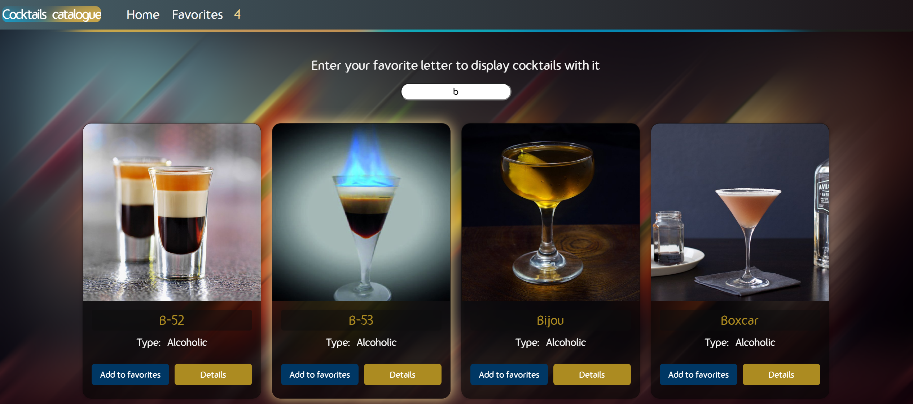

  <h2>Cocktails site</h2>
  Find interesting cocktails and get theirs recipe, if you like a specific one, add it to favorites.

 
Technologies used: React.js, Sass, react-redux, react-router, gsap, react-boostrap, lottie-react.

Open this link [https://cocktail-site-andrei.netlify.app/](https://cocktail-site-andrei.netlify.app/) to view it.

## Site images

## Available Scripts

Open the project directory and there you can type (using Git Bash):

### `npm install`
### `npm start`

Open this link [http://localhost:3000](http://localhost:3000) to view it in your browser.

